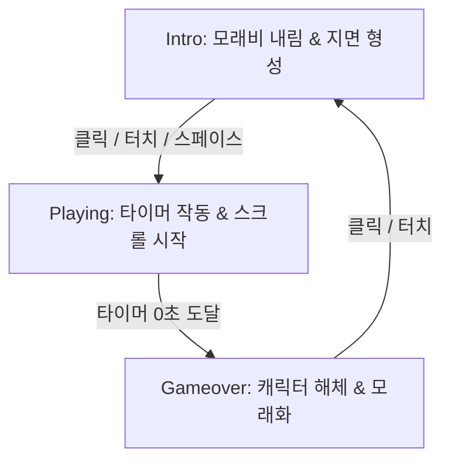

# 네모세모동그라미 (Runner) — 개발자 핸드오프 (HANDOFF)
> **대상:** 개발진 및 AI 협업 어시스턴트 (Claude Code 등)
> **최종 갱신:** 2026-05-24
> **참조 문서:** `CLAUDE.md`, `docs/RULES.md`

---

## 1. 개요 및 프로젝트 정보

*   **게임명:** 네모세모동그라미 (runner / speedrun)
*   **챕터:** 미정 (채널 타임라인 진행도에 따라 연동 예정)
*   **해상도:** 480 × 270 (16:9 와이드 스크린)
*   **제약 조건:** 최대 12색 팔레트, 1px 단위의 픽셀 퍼펙트 렌더링
*   **진입점:** `/content/speedrun/index.html` (샌드 엔진 runner로 실행됨)

---

## 2. 아키텍처 및 폴더 구조

현재 게임의 소스코드는 `/content/speedrun/` 하위에 위치해 있으며, 다음과 같은 모듈식 스크립트 구조를 가집니다.

```
content/speedrun/
├── game.json                 ← 게임 매니페스트 (해상도, 팔레트, 씬 정의)
├── index.html                ← 게임 러너 진입점 (SandEngine 초기화 및 씬 스택 푸시)
├── scenes/
│   └── title.json            ← 타이틀 씬 (JSON 기반 정적 씬)
└── scripts/
    ├── runner_config.js      ← 게임의 물리 상수, 타이머 설정, 색상 인덱스 정의
    ├── RunnerScene.js        ← 메인 씬 (상태 업데이트, 드로잉 루프, 파티클 효과)
    ├── ShapeCharacter.js     ← 플레이어 캐릭터 엔티티 (물리, 점프, 3단 변신 로직)
    ├── RunnerSpawner.js      ← 장애물/코인/아이템의 스폰 주기 및 리스트 관리
    ├── TerrainSystem.js      ← 진행 속도에 맞춰 스크롤되는 곡선형 지면 좌표 연동
    ├── RunnerHud.js          ← 시간 타이머, 게이지, 스코어 및 연출 HUD 드로잉
    └── CameraSystem.js       ← 점프 및 코인 획득 시 진동 효과를 주는 카메라 이펙트
```

---

## 3. 렌더링 파이프라인 (듀얼 캔버스 구조)

현재 러너 게임은 샌드 엔진의 캔버스와 오버레이 캔버스를 겹쳐서 사용하는 **듀얼 캔버스 파이프라인**을 사용하고 있습니다.

1.  **`sand-canvas` (SandEngine Core)**
    *   **역할:** 배경(Layer 0), 정적 요소들, 엔진 내부 프리펩 렌더링.
    *   **접근:** `engine/` 모듈 및 `AssetLoader`를 이용해 팔레트를 전환하고 배경 픽셀을 그림.
2.  **`game-overlay` (2D Canvas Context)**
    *   **역할:** 플레이어 캐릭터(`ShapeCharacter`), 아이템(`coin`, `fast`, `slow`), HUD(스코어, 타이머), 특수 효과 파티클(모래비, 크래시 이펙트, 스미어 트레일).
    *   **이유:** 유동적인 물리 상태와 즉각적인 그리기 연출을 위해 오버레이 캔버스의 HTML5 2D API를 직접 활용하여 드로잉.

> [!NOTE]
> **차기 개선 사항 (JSON 데이터 드리븐 전환):**
> `ENGINE.md` 규칙에 따라 향후 `speedrun_game`도 `live` 타입(HTML 통째 실행)에서 완전히 `json` 타입 씬으로 전환되어야 합니다. 이때 캐릭터와 임시 파티클 역시 샌드 엔진의 `EntitySystem` 및 `ParticleSystem`을 활용하도록 마이그레이션이 필요합니다.

---

## 4. 게임 루프 및 페이즈 (Phases)

게임의 주요 흐름은 `RunnerScene.js` 내의 `_phase` 상태에 의해 관리됩니다.



### 1) Intro Phase
*   **동작:** 빈 어두운 화면에서 1px 모래비(`_sandPool`)가 내리며 하단에 지면 형태를 이웁니다.
*   **대기:** 지면이 완전히 형성된 후 "CLICK TO START" 텍스트가 깜빡이며, 화면 클릭(또는 스페이스바) 입력 시 카메라 흔들림과 함께 `playing` 페이즈로 전입합니다.

### 2) Playing Phase
*   **동작:** 타이머가 매초 감소하며 화면이 오른쪽으로 스크롤됩니다. 캐릭터는 장애물을 피하며 코인을 획득해 시간을 늘려야 합니다.
*   **소수점 프레임 보정:** 델타 타임에 `CFG.DELTA_CAP`을 적용하여 프레임 드랍 시의 통과 버그를 보완합니다.

### 3) Gameover Phase
*   **동작:** 플레이어 캐릭터가 여러 개의 픽셀 입자로 바스러지는 해체(Erosion) 이펙트가 발생합니다.
*   **전환:** 결과 스코어가 로컬스토리지에 저장되고, "AGAIN?" 문구가 나타나 대기 상태로 들어갑니다.

---

## 5. 3단 형태 변신(Shape Shift) 메커니즘

플레이어의 핵심 매커니즘인 형태 변신 상태는 `ShapeCharacter.js`의 `shape` 프로퍼티와 `RunnerScene.js`의 `_speedMult` 상수를 통해 연동됩니다.

| 형태 (Shape) | 획득 아이템 | 속도 배율 (`_speedMult`) | 특징 및 이동 특성 |
| :--- | :--- | :--- | :--- |
| **Square (네모)** | 기본 상태 | `1.0` | 기본 점프 및 공중 2단 점프 가능 |
| **Circle (동그라미)** | 파란 동그라미 | `2.0` (Boost) | 속도가 급증하며, 캐릭터 뒤편에 **스미어 트레일**과 **부스트 스트릭** 이펙트 생성 |
| **Triangle (세모)** | 빨간 세모 | `0.5` (Slow) | 속도가 느려지며, 화면 테두리에 붉은색 **비네트(Vignette) 효과** 연출 |

*   **변신 제한 시간:** 아이템 획득 시 일정 시간(`CFG.TRANSFORM_DURATION`) 동안 형태가 유지되며, 타이머가 만료되면 자동으로 `Square`로 복귀합니다.
*   **팔레트 플래시:** 상태가 바뀔 때마다 즉각적인 팔레트 색상 전송 및 복구를 통해 시각적인 임팩트를 부여합니다.

---

## 6. 채널 API 연동 규약 (postMessage)

`CLAUDE.md`의 API 계약을 충족하기 위해 `index.html` 내부에 아래의 이벤트 리스너 및 통신 인터페이스가 구현되어 있습니다.

### 1) 수신 (채널 → 게임)
```javascript
window.addEventListener('message', (e) => {
    if (!e.data?.type) return;
    if (e.data.type === 'start')   // 게임 초기화 및 물리 루프 가동
    if (e.data.type === 'pause')   // 엔진 업데이트 중지
    if (e.data.type === 'resume')  // 엔진 업데이트 재개
});
```

### 2) 송신 (게임 → 채널)
*   **준비 완료:** 게임 로드가 완료되면 채널에 `ready` 상태를 전송합니다.
    ```javascript
    window.parent.postMessage({ type: 'ready' }, '*');
    ```
*   **종료/결과 전송:** 게임오버 시 최종 스코어 및 획득한 코인 등의 통계를 전송하여 아바타 진화 트리거를 작동시킵니다.
    ```javascript
    window.parent.postMessage({ 
        type: 'complete', 
        result: { score: Math.floor(score), coins: coinCount } 
    }, '*');
    ```

---

## 7. 단이(안티그래비티) 작업 가이드라인

*   **픽셀 에셋 교체:**
    *   현재 임시로 드로잉하는 코드(예: `ShapeCharacter.js`의 `draw()` 함수 내 도형 그리기 코드)는 비주얼 컨셉 확정 이후 **`pixels.json` 기반의 스프라이트 데이터**로 전면 전환되어야 합니다.
    *   픽셀 툴로 작업 완료된 픽셀 JSON 데이터는 `/assets/pixels/`에 위치시키고, `RunnerScene` 로드 시 `AssetLoader`를 이용해 캐시하도록 설정합니다.
*   **팔레트 통제:**
    *   `/assets/palettes/palette_runner.json`의 색상 값을 임의로 훼손하지 않아야 하며, 12색 인덱스를 엄격히 지켜야 합니다.
